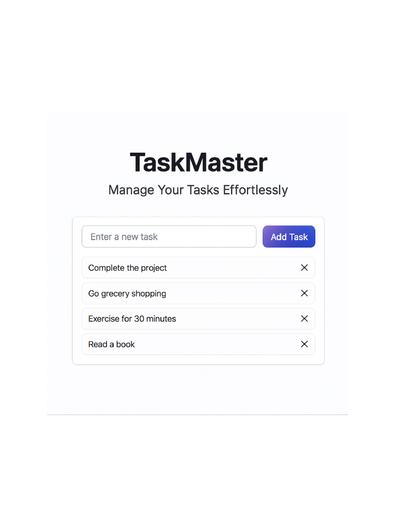

TaskMaster: Full-Stack To‑Do Task Management App

A web application that lets users sign in via social providers (Google, GitHub, Facebook) and perform full CRUD operations on personal to‑do tasks. This project demonstrates end‑to‑end engineering skills including API design, database modeling, UI implementation, and cloud deployment.

🌟 Features

* Social Authentication with Google, GitHub, and Facebook
  
* CRUD on Tasks
  
   * Create new tasks
   * Read/list existing tasks
   * Update task titles, descriptions, and completion status
   * Delete tasks
  
* User‑specific data: Each user sees only their own tasks
  
* Responsive UI built with React

* RESTful API backend on Node.js/Express (or Nest)

* Persistent storage in a MongoDB (NoSQL) database

* Deployed to a free cloud platform (e.g. Vercel for frontend, Railway/Heroku for backend)

🛠️ Tech Stack

* Backend: Node.js, Express (or Nest.js), JWT, OAuth 2.0

* Frontend: React, React Router, Tailwind CSS

* Database: MongoDB (Atlas) or PostgreSQL

* Deployment: Vercel (frontend), Railway or Heroku (backend)

* Others: GitHub Actions (CI/CD), dotenv for environment variables

🚀 Getting Started

Prerequisites:

* Node.js v16+ and npm

* A MongoDB Atlas account (or local MongoDB)

* OAuth credentials for Google, GitHub, and Facebook

Installation:

1.Backend setup:

cd server

cp .env.example .env

npm install

npm start

2.Frontend setup:

cd ../client

cp .env.example .env

npm install

npm start

📐 Architecture Diagram

This diagram shows how the React frontend interacts with the Express backend and MongoDB database. The OAuth flow is also illustrated, showing redirection to providers and token-based user session handling.

📸 Screenshots

## 🔐 Login Page Screenshot

## ✅ Task View Screenshot

This project is a part of a hackathon run by https://www.katomaran.com

